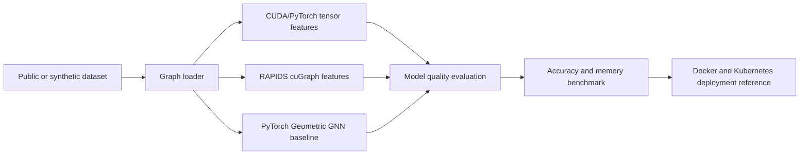

# CUDA 13 Graph AI Fraud Detection


CUDA 13 compatible GPU examples for graph-based fraud detection, anomaly scoring, public fraud datasets, model accuracy benchmarking, and memory-efficient financial risk analytics.

## Why this project matters

Fraud and mule-risk detection systems need models that are accurate, explainable, and memory-efficient enough for production deployment. This project demonstrates how CUDA 13.x, PyTorch, RAPIDS cuGraph, and PyTorch Geometric can support graph feature extraction, anomaly scoring, model-quality evaluation, memory-footprint analysis, and production-oriented AI workflows.

## Features

- CUDA 13 Docker environment
- GPU smoke test
- Model accuracy and memory-footprint benchmark
- Synthetic transaction graph generator
- Public credit-card fraud dataset example
- Public Elliptic Bitcoin transaction graph loader
- RAPIDS cuGraph example for GPU graph analytics
- PyTorch Geometric GraphSAGE baseline
- GPU-accelerated anomaly scoring example
- CI workflow for CPU validation
- Kubernetes GPU deployment reference
- MLOps-friendly project structure

## Tested stack

| Component | Version |
|---|---|
| CUDA Toolkit | 13.x |
| NVIDIA CUDA Docker image | `nvidia/cuda:13.3.0-devel-ubuntu24.04` |
| NVIDIA Driver | Use CUDA 13 compatible driver |
| Python | 3.10+ |
| OS | Ubuntu 24.04 recommended |
| Docker | NVIDIA Container Toolkit required for GPU runtime |

## Quick start

### 1. Verify GPU and CUDA

```bash
nvidia-smi
nvcc --version
```

### 2. Build Docker image

```bash
docker build -f Dockerfile.cuda13 -t cuda13-graph-ai-fraud-detection:latest .
```

### 3. Run GPU smoke test

```bash
docker run --rm --gpus all cuda13-graph-ai-fraud-detection:latest
```

Expected output:

```text
CUDA available: True
GPU test passed
```

## Run locally without Docker

```bash
python3 -m venv .venv
source .venv/bin/activate
pip install --upgrade pip
pip install -r requirements.txt
python examples/gpu_smoke_test.py
python examples/graph_feature_gpu.py
python benchmarks/model_quality_memory_benchmark.py --csv data/creditcard.csv
```

Common commands are also available through `make`:

```bash
make install
make test
make smoke
make benchmark
make creditcard
make elliptic
make rapids-elliptic
make pyg-elliptic
```

## Benchmark focus

This repository benchmarks **model quality and memory footprint**, not raw execution speed.

Primary benchmark metrics:

- accuracy
- precision
- recall
- F1 score
- parameter count
- model size in MB
- peak CUDA memory in MB when CUDA is available

Run:

```bash
python benchmarks/model_quality_memory_benchmark.py --csv data/creditcard.csv
```

This compares a compact logistic fraud model against a wider MLP to show the trade-off between model quality and memory footprint.

## Public dataset examples

This repository does not commit datasets directly. Download each dataset from its official public source and place it under `data/`.

### Credit-card fraud dataset

Expected file:

```text
data/creditcard.csv
```

Run:

```bash
python examples/public_creditcard_fraud_gpu.py --csv data/creditcard.csv
```

This trains a compact GPU-friendly PyTorch classifier and reports accuracy, precision, recall, F1, parameter count, model size, and peak CUDA memory.

### Elliptic Bitcoin graph dataset

Expected directory:

```text
data/elliptic_bitcoin_dataset/
```

Expected files:

```text
elliptic_txs_features.csv
elliptic_txs_classes.csv
elliptic_txs_edgelist.csv
```

Run the basic loader:

```bash
python examples/elliptic_graph_loader.py --data-dir data/elliptic_bitcoin_dataset
```

Run the RAPIDS cuGraph example in a RAPIDS environment:

```bash
python examples/rapids_cugraph_elliptic.py --data-dir data/elliptic_bitcoin_dataset
```

Run the PyTorch Geometric GraphSAGE baseline in a PyG environment:

```bash
python examples/pyg_gnn_elliptic_baseline.py --data-dir data/elliptic_bitcoin_dataset
```

More details: [`docs/public-datasets.md`](docs/public-datasets.md)

## Architecture



## Project structure

```text
cuda13-graph-ai-fraud-detection/
  README.md
  Dockerfile.cuda13
  requirements.txt
  Makefile
  LICENSE
  .gitignore
  src/
    metrics.py
  examples/
    gpu_smoke_test.py
    graph_feature_gpu.py
    anomaly_score_gpu.py
    public_creditcard_fraud_gpu.py
    elliptic_graph_loader.py
    rapids_cugraph_elliptic.py
    pyg_gnn_elliptic_baseline.py
  benchmarks/
    model_quality_memory_benchmark.py
    results.md
  docs/
    architecture.md
    cuda13-migration-notes.md
    public-datasets.md
  k8s/
    gpu-deployment.yaml
  tests/
    test_cpu_fallback.py
  .github/workflows/
    ci.yml
```

## Use case

This repository uses synthetic and public fraud-style datasets to demonstrate GPU-friendly patterns for:

- graph feature extraction
- suspicious node scoring
- transaction anomaly scoring
- mule-risk style network analytics
- public fraud dataset experimentation
- accuracy, F1, and memory-footprint benchmarking
- RAPIDS/cuGraph graph features
- GraphSAGE baseline modeling

The synthetic data does not contain real payment data. Public datasets should be downloaded separately according to their own terms of use.

## Contribution roadmap

- [ ] Add measured CUDA 13 GPU memory benchmark results
- [ ] Add public-dataset accuracy and F1 benchmark results
- [ ] Add compact GNN memory comparison
- [ ] Add custom CUDA kernel example for memory-efficient edge aggregation
- [ ] Add self-hosted GitHub Actions GPU runner guide
- [ ] Add Kubernetes autoscaling pattern for GPU inference
- [ ] Add model monitoring dashboard

## Suggested GitHub topics

`cuda`, `cuda-13`, `gpu-computing`, `graph-ai`, `fraud-detection`, `anomaly-detection`, `financial-crime`, `mlops`, `pytorch`, `docker`, `kubernetes`, `responsible-ai`, `rapids`, `cugraph`, `pytorch-geometric`, `model-compression`, `memory-efficient-ai`

## License

Apache-2.0
