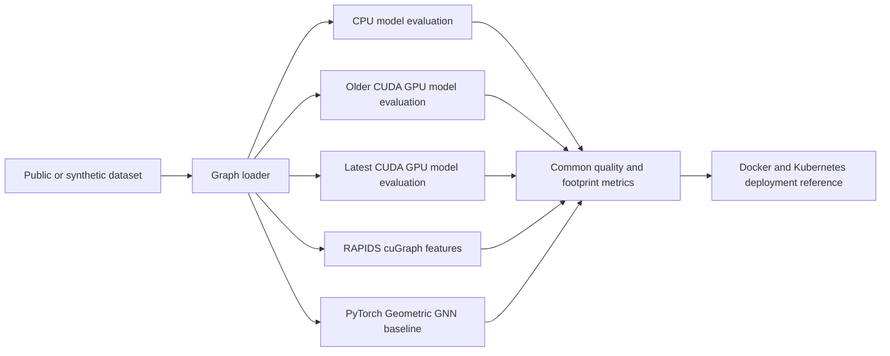

# CUDA 13 Graph AI Fraud Detection


CUDA 13 compatible GPU examples for graph-based fraud detection, anomaly scoring, public fraud datasets, model quality benchmarking, and model-footprint comparison.

## Why this project matters

Fraud and mule-risk detection systems need models that are accurate, explainable, and efficient enough for production deployment. This project demonstrates how CUDA 13.x, PyTorch, RAPIDS cuGraph, and PyTorch Geometric can support graph feature extraction, anomaly scoring, CPU-vs-GPU model-quality evaluation, model-footprint analysis, and production-oriented AI workflows.

## Features

- CUDA 13 Docker environment
- GPU smoke test
- CPU vs GPU model-quality and model-footprint benchmark
- Benchmark matrix for CPU, older CUDA GPU, and latest CUDA GPU environments
- Synthetic transaction graph generator
- Public credit-card fraud dataset example
- Public Elliptic Bitcoin transaction graph loader
- RAPIDS cuGraph example for GPU graph analytics
- PyTorch Geometric GraphSAGE baseline
- GPU-accelerated anomaly scoring example
- CI workflow for CPU validation
- Kubernetes GPU deployment reference
- MLOps-friendly project structure

## Tested stack

| Component | Version |
|---|---|
| CUDA target | 13.x |
| Current CUDA alignment | CUDA Toolkit 13.3 / 13.3 Update 1 notes |
| NVIDIA CUDA Docker image | `nvidia/cuda:13.3.0-devel-ubuntu24.04` |
| NVIDIA Driver | `>=580` for CUDA 13.x compatibility; `>=610.43.02` preferred for CUDA 13.3 / 13.3 Update 1 alignment |
| Python | 3.10+ |
| OS | Ubuntu 24.04 recommended |
| Docker | NVIDIA Container Toolkit required for GPU runtime |

See [`docs/cuda-version-support.md`](docs/cuda-version-support.md) for CUDA 13.3 Update 1 validation notes, component versions, and driver guidance.

## Quick start

### 1. Verify GPU and CUDA

```bash
nvidia-smi
nvcc --version
```

### 2. Build Docker image

```bash
docker build -f Dockerfile.cuda13 -t cuda13-graph-ai-fraud-detection:latest .
```

### 3. Run GPU smoke test

```bash
docker run --rm --gpus all cuda13-graph-ai-fraud-detection:latest
```

Expected output:

```text
CUDA available: True
GPU test passed
```

## Run locally without Docker

```bash
python3 -m venv .venv
source .venv/bin/activate
pip install --upgrade pip
pip install -r requirements.txt
python examples/gpu_smoke_test.py
python examples/graph_feature_gpu.py
python benchmarks/model_quality_memory_benchmark.py --csv data/creditcard.csv --device both
```

Common commands are also available through `make`:

```bash
make install
make test
make smoke
make benchmark
make benchmark-cpu
make benchmark-cuda-old
make benchmark-cuda-latest
make creditcard
make elliptic
make rapids-elliptic
make pyg-elliptic
```

## Benchmark focus

This repository benchmarks only metrics that can be produced consistently across all three benchmark environments: CPU, older CUDA GPU, and latest CUDA GPU.

Included metrics:

- accuracy
- precision
- recall
- F1 score
- parameter count
- model size in MB

Excluded metrics:

- runtime speed
- peak CUDA memory
- GPU utilization
- CUDA kernel timing
- throughput

Benchmark matrix:

```text
CPU baseline
GPU with older CUDA environment, recommended label: cuda-12-old
GPU with latest CUDA 13.3 / 13.3 Update 1 aligned environment, label: cuda-13-latest
```

Run CPU baseline:

```bash
python benchmarks/model_quality_memory_benchmark.py --csv data/creditcard.csv --device cpu --label cpu-baseline
```

Run older CUDA GPU environment:

```bash
python benchmarks/model_quality_memory_benchmark.py --csv data/creditcard.csv --device cuda --label cuda-12-old
```

Run latest CUDA GPU environment:

```bash
python benchmarks/model_quality_memory_benchmark.py --csv data/creditcard.csv --device cuda --label cuda-13-latest
```

This compares a compact logistic fraud model against a wider MLP and reports only the common benchmark metrics across CPU, older CUDA GPU, and latest CUDA GPU environments.

Full execution guide: [`docs/benchmark-execution-matrix.md`](docs/benchmark-execution-matrix.md)

## Public dataset examples

This repository does not commit datasets directly. Download each dataset from its official public source and place it under `data/`.

### Credit-card fraud dataset

Expected file:

```text
data/creditcard.csv
```

Run:

```bash
python examples/public_creditcard_fraud_gpu.py --csv data/creditcard.csv
```

This trains a compact GPU-friendly PyTorch classifier and reports accuracy, precision, recall, F1, parameter count, and model size.

### Elliptic Bitcoin graph dataset

Expected directory:

```text
data/elliptic_bitcoin_dataset/
```

Expected files:

```text
elliptic_txs_features.csv
elliptic_txs_classes.csv
elliptic_txs_edgelist.csv
```

Run the basic loader:

```bash
python examples/elliptic_graph_loader.py --data-dir data/elliptic_bitcoin_dataset
```

Run the RAPIDS cuGraph example in a RAPIDS environment:

```bash
python examples/rapids_cugraph_elliptic.py --data-dir data/elliptic_bitcoin_dataset
```

Run the PyTorch Geometric GraphSAGE baseline in a PyG environment:

```bash
python examples/pyg_gnn_elliptic_baseline.py --data-dir data/elliptic_bitcoin_dataset
```

More details: [`docs/public-datasets.md`](docs/public-datasets.md)

## Architecture



## Project structure

```text
cuda13-graph-ai-fraud-detection/
  README.md
  Dockerfile.cuda13
  requirements.txt
  Makefile
  LICENSE
  .gitignore
  src/
    metrics.py
  examples/
    gpu_smoke_test.py
    graph_feature_gpu.py
    anomaly_score_gpu.py
    public_creditcard_fraud_gpu.py
    elliptic_graph_loader.py
    rapids_cugraph_elliptic.py
    pyg_gnn_elliptic_baseline.py
  benchmarks/
    model_quality_memory_benchmark.py
    results.md
  docs/
    architecture.md
    benchmark-execution-matrix.md
    cuda13-migration-notes.md
    cuda-version-support.md
    public-datasets.md
  k8s/
    gpu-deployment.yaml
  tests/
    test_cpu_fallback.py
  .github/workflows/
    ci.yml
```

## Use case

This repository uses synthetic and public fraud-style datasets to demonstrate GPU-friendly patterns for:

- graph feature extraction
- suspicious node scoring
- transaction anomaly scoring
- mule-risk style network analytics
- public fraud dataset experimentation
- CPU vs GPU accuracy, precision, recall, F1, parameter count, and model-size benchmarking
- older CUDA vs latest CUDA GPU benchmark comparison
- RAPIDS/cuGraph graph features
- GraphSAGE baseline modeling

The synthetic data does not contain real payment data. Public datasets should be downloaded separately according to their own terms of use.

## Contribution roadmap

- [ ] Add measured CPU baseline, old CUDA GPU, and latest CUDA GPU benchmark results
- [ ] Add public-dataset CPU vs GPU accuracy and F1 benchmark results
- [ ] Add compact GNN model-footprint comparison
- [ ] Add custom CUDA kernel example for graph feature extraction
- [ ] Add self-hosted GitHub Actions GPU runner guide
- [ ] Add Kubernetes autoscaling pattern for GPU inference
- [ ] Add model monitoring dashboard

## Suggested GitHub topics

`cuda`, `cuda-13`, `gpu-computing`, `graph-ai`, `fraud-detection`, `anomaly-detection`, `financial-crime`, `mlops`, `pytorch`, `docker`, `kubernetes`, `responsible-ai`, `rapids`, `cugraph`, `pytorch-geometric`, `model-compression`, `memory-efficient-ai`

## License

Apache-2.0
